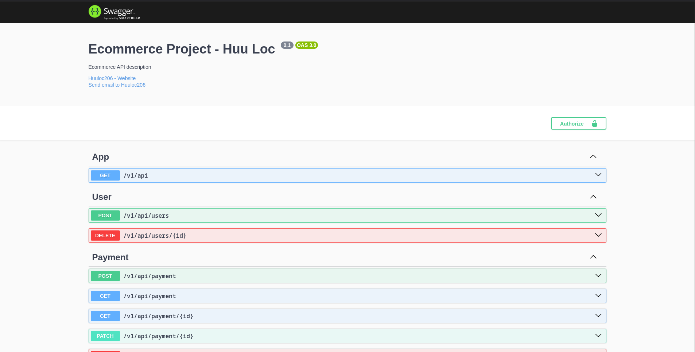
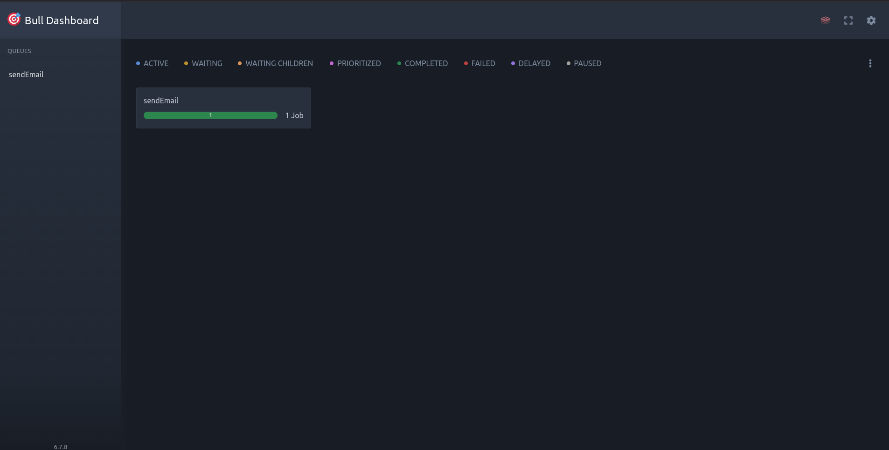
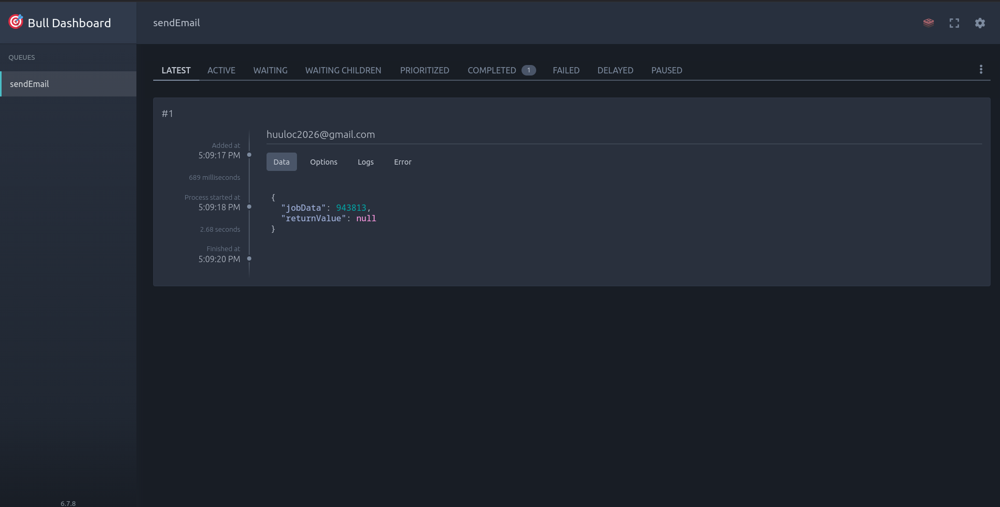
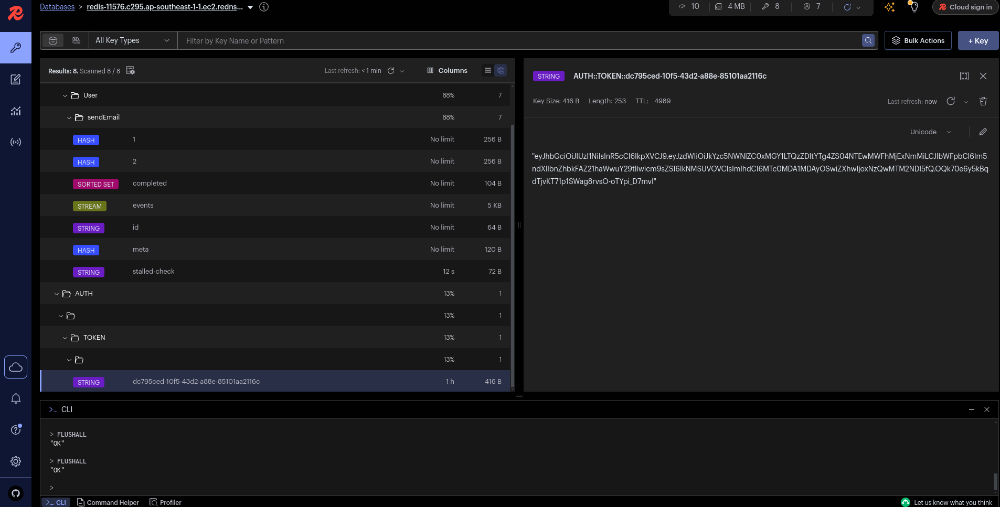

## Screenshots


# Hexagonal Architecture E-commerce API with NestJS

This project demonstrates a clean and maintainable e-commerce API built with NestJS, following the principles of Hexagonal Architecture (also known as Ports and Adapters Architecture).

## Table of Contents

- [Introduction](#introduction)
- [Architecture](#architecture)
- [Features](#features)
- [Technologies](#technologies)
- [Installation](#installation)
- [Usage](#usage)
- [Project Structure](#project-structure)
- [Testing](#testing)
- [Further Development](#further-development)
- [ScreenShot](#screenshot)
- [Contributing](#contributing)
- [License](#license)

## Introduction

Hexagonal Architecture promotes loose coupling between the core business logic and the external dependencies (databases, APIs, UI). This makes the application more flexible, testable, and easier to maintain. This project showcases how to implement this architecture in a NestJS application.

## Architecture

The application is structured around the following layers:

- **Core (Domain):** Contains the business logic, entities, and use cases. It's completely independent of any external frameworks or libraries.
- **Application:** Defines the use case interfaces (ports) that the Core interacts with. It orchestrates the interaction between the Core and the infrastructure.
- **Infrastructure (Adapters):** Implements the interfaces defined in the Application layer. This layer contains the concrete implementations for database access, external API calls, and other I/O operations.

## Features

- Product Management (CRUD operations)
- Shopping Cart
- Order Processing
- User Authentication (Example implementation)
- ... (Add more features as you develop)

## Technologies

- NestJS
- TypeScript
- Prisma (Example ORM, can be replaced)
- PostgreSQL (Example database, can be replaced)
- Jest (Testing framework)
- ... (Add other technologies used)

## Installation

1. Clone the repository:

```bash
git clone https://github.com/huuloc2026/nestjs-microservices-2025
```

Install dependencies:

```
npm install
#or
yarn install
```

2. Configure environment variables:

Create a .env file in the root directory and add the necessary environment variables 1 (e.g., database connection string, JWT secret). See .env.example for a template.  

To run this project, you will need to add the following environment variables to your .env file

```
#Mail
MAIL_SERVICE=
MAIL_HOST=
MAIL_PORT=
MAIL_SECURE=
MAIL_USER=
MAIL_PASS=
MAIL_FROM=

#Redis
CACHE_URL=
CACHE_TTL=
CACHE_HOST=
CACHE_PORT=
CACHE_username=
CACHE_password=
```

3. Run database migrations:

```
npx prisma migrate dev --name init
```

4. Start the development server:

```
npm run start:dev
```

Access the API at http://localhost:3000.

**Key Improvements and Explanations for the README:**

- **Clear Structure:** The README is well-organized with clear headings and a table of contents.
- **Focus on Hexagonal Architecture:** The architecture section explains the core concepts and visually represents the layers.
- **Concise Explanations:** Each section provides a brief and to-the-point explanation.
- **Standard Sections:** The README includes all the essential sections (installation, usage, testing, etc.).
- **Project Structure:** The project structure section gives a clear overview of how the code is organized.
- **Further Development:** This section provides ideas for extending the project.
- **Contribution Guidelines:** Includes a call for contributions.
- **License Information:** Specifies the license.
- **Example Code Snippets:** Includes relevant code snippets for installation and usage.
- **Emphasis on Ports and Adapters:** The description of Hexagonal Architecture correctly uses the terms "ports" (interfaces) and "adapters" (implementations).

## Testing

Run unit and integration tests:

```
npm run test
```

## Further Development

- **Implement more e-commerce features (e.g., payments, shipping).**
- **Add robust error handling and logging.**
- **Implement API documentation (e.g., using Swagger).**
- **Explore different database options.**
- **Implement proper authentication and authorization.**

## ScreenShot






## Contributing

Contributions are welcome! Please open an issue or submit a pull request.

## License

MIT

## Authors

- [@huuloc2026](https://www.github.com/huuloc2026)

## Deployment

To deploy this project run

```bash
  yarn run dev
```
